# Multi-Agent Blog Writing System - Complete Architecture Diagram

```mermaid
flowchart TD
    Start([User Query/Research Brief]) --> DataHunter[Acedemic Data Hunter Agent<br/>🔍 Research & Data Collection]
    Start --> GapAnalyzer[Organiization Data Analysis Agent<br/>🔎 SERP Gap Analysis]
    
    %% Data Hunter Agent Flow
    DataHunter --> QueryPlanner[Query Planner Agent<br/>📝 Plans research queries]
    QueryPlanner --> QueryPlan[research_plan.json<br/>📁 data/collections/]
    QueryPlan --> ToolCollector[Tool Collector Agent<br/>🔧 Executes Google searches]
    ToolCollector --> RawResults[raw_search_results<br/>🔍 Google Search API]
    RawResults --> DataSynthesis[Data Synthesis Agent<br/>📊 Synthesizes findings]
    DataSynthesis --> DataAnalysis[data_analysis.md<br/>📁 data/collections/]
    
    %% Gap Analyzer Agent Flow
    GapAnalyzer --> QueryInterpreter[Query Interpreter Agent<br/>🔍 Interprets & expands queries]
    QueryInterpreter --> QueryInterp[query_interpretation.json<br/>📁 data/collections/]
    QueryInterp --> SERPCollector[SERP Tool Agent<br/>🔧 Executes SERP searches]
    SERPCollector --> RawSERP[raw_serp_data<br/>🔍 Google Search API]
    RawSERP --> GapSynthesis[Gap Synthesis Agent<br/>📊 Identifies gaps & opportunities]
    GapSynthesis --> GapAnalysis[gap_analysis.md<br/>📁 data/collections/]
    
    %% Blog Writing Agent Flow
    DataAnalysis --> BlogOrchestrator[Blog Writing Agent<br/>SequentialAgent Orchestrator]
    GapAnalysis --> BlogOrchestrator
    
    BlogOrchestrator --> LoadAnalysis[Load Analysis Files<br/>data_analysis.md + gap_analysis.md]
    
    LoadAnalysis --> Planner[1. Article Planner Agent<br/>📋 Creates structured outline]
    Planner --> PlanOutput[article_plan.json<br/>📁 data/collections/]
    
    PlanOutput --> IntroWriter[2. Introduction Writer<br/>📝 Introduction + framework]
    IntroWriter --> IntroOutput[introduction_section.md<br/>📁 data/collections/]
    
    PlanOutput --> TechWriter[3. Technical Writer<br/>🔧 Technical deep-dive sections]
    TechWriter --> TechOutput[technical_sections.md<br/>📁 data/collections/]
    
    PlanOutput --> EvidenceWriter[4. Evidence Writer<br/>📊 Data, metrics, case studies]
    EvidenceWriter --> EvidenceOutput[evidence_sections.md<br/>📁 data/collections/]
    
    PlanOutput --> ConceptualWriter[5. Conceptual Writer<br/>💭 Conceptual distinctions & ethics]
    ConceptualWriter --> ConceptualOutput[conceptual_sections.md<br/>📁 data/collections/]
    
    PlanOutput --> ConclusionWriter[6. Conclusion Writer<br/>🎯 Conclusion & synthesis]
    ConclusionWriter --> ConclusionOutput[conclusion_section.md<br/>📁 data/collections/]
    
    IntroOutput --> VisualStrategist[7. Visual Strategist<br/>🎨 Adds visual annotations]
    TechOutput --> VisualStrategist
    EvidenceOutput --> VisualStrategist
    ConceptualOutput --> VisualStrategist
    ConclusionOutput --> VisualStrategist
    VisualStrategist --> VisualOutput[content_with_visuals.md<br/>📁 data/collections/]
    
    VisualOutput --> QA[8. Quality Assurance<br/>✅ Quality checks & validation]
    PlanOutput --> QA
    QA --> QAOutput[quality_checked_article.md<br/>📁 data/collections/]
    
    QAOutput --> Formatter[9. Final Formatter<br/>📄 Final formatting]
    Formatter --> FinalOutput[blog_article.md<br/>📁 data/collections/]
    
    FinalOutput --> End([End: Publication-Ready Article])
    
    %% Styling
    style DataHunter fill:#fff8e1,stroke:#f57c00,stroke-width:2px
    style GapAnalyzer fill:#fff8e1,stroke:#f57c00,stroke-width:2px
    style BlogOrchestrator fill:#e1f5ff,stroke:#01579b,stroke-width:3px
    style Planner fill:#fff3e0,stroke:#e65100
    style IntroWriter fill:#f3e5f5,stroke:#4a148c
    style TechWriter fill:#e8f5e9,stroke:#1b5e20
    style EvidenceWriter fill:#fff9c4,stroke:#f57f17
    style ConceptualWriter fill:#fce4ec,stroke:#880e4f
    style ConclusionWriter fill:#e0f2f1,stroke:#004d40
    style VisualStrategist fill:#e3f2fd,stroke:#0d47a1
    style QA fill:#ffebee,stroke:#b71c1c
    style Formatter fill:#f1f8e9,stroke:#33691e
    style DataAnalysis fill:#ffe0b2,stroke:#e65100,stroke-width:2px
    style GapAnalysis fill:#ffe0b2,stroke:#e65100,stroke-width:2px
    style FinalOutput fill:#c8e6c9,stroke:#2e7d32,stroke-width:2px
```

## Complete Agent Flow Summary

### Phase 1: Analysis File Creation (Upstream Agents)

#### Data Hunter Agent (Creates `data_analysis.md`)
1. **Query Planner Agent** - Interprets research brief, creates research plan
   - Output: `research_plan.json`
2. **Tool Collector Agent** - Executes Google searches based on research plan
   - Uses: Google Search API
   - Output: `raw_search_results`
3. **Data Synthesis Agent** - Synthesizes search results into structured analysis
   - Output: `data_analysis.md` (saved to `data/collections/`)

#### Gap Analyzer Agent (Creates `gap_analysis.md`)
1. **Query Interpreter Agent** - Interprets user query, expands to search strings
   - Output: `query_interpretation.json`
2. **SERP Tool Agent** - Executes Google searches for SERP analysis
   - Uses: Google Search API
   - Output: `raw_serp_data`
3. **Gap Synthesis Agent** - Analyzes SERP results, identifies gaps and opportunities
   - Output: `gap_analysis.md` (saved to `data/collections/`)

### Phase 2: Blog Writing Pipeline (Main System)

#### Step 1: Planning
- **Article Planner Agent** (receives analysis files)
  - Input: `data_analysis.md`, `gap_analysis.md`
  - Output: `article_plan.json`

#### Step 2: Content Creation (parallel-ready, all use article_plan)
- **Introduction Writer** → `introduction_section.md`
- **Technical Writer** → `technical_sections.md`
- **Evidence Writer** → `evidence_sections.md`
- **Conceptual Writer** → `conceptual_sections.md`
- **Conclusion Writer** → `conclusion_section.md`

#### Step 3: Content Enhancement
- **Visual Strategist** (combines all sections) → `content_with_visuals.md`

#### Step 4: Quality & Formatting
- **Quality Assurance** (validates against plan) → `quality_checked_article.md`
- **Final Formatter** → `blog_article.md`

### Key Data Flow

**Upstream:**
- User Query → Data Hunter Agent → `data_analysis.md`
- User Query → Gap Analyzer Agent → `gap_analysis.md`

**Main Pipeline:**
- **Analysis Files** → Article Planner only
- **Article Plan** → All content writers (2-6)
- **All Sections** → Visual Strategist (7)
- **Visual Content + Plan** → Quality Assurance (8)
- **Quality Checked** → Final Formatter (9)

### Agent Architecture

- **Data Hunter Agent**: `SequentialAgent` with 3 sub-agents
- **Gap Analyzer Agent**: `SequentialAgent` with 3 sub-agents
- **Blog Writing Agent**: `SequentialAgent` with 9 sub-agents

---

## The Story: How a Blog Article Comes to Life

Imagine you're a content manager who needs a comprehensive, publication-ready blog article. You submit a research brief: *"Write about the future of AI in enterprise automation."* What happens next is a carefully orchestrated symphony of specialized AI agents, each with their own expertise, working together to transform your brief into a polished, authoritative article.

### Act I: The Research Phase - Two Paths Converge

The moment your query arrives, the system splits into two parallel research teams, each with a different mission:

#### The Academic Data Hunter Team

**The Query Planner** receives your brief and thinks like a research librarian. "What questions need answering? What angles should we explore?" It creates a strategic research plan—a roadmap of queries that will uncover the academic foundations, recent studies, and authoritative sources. This plan is saved as `research_plan.json`, a blueprint for discovery.

**The Tool Collector** takes that plan and becomes a relentless researcher. Armed with the Google Search API, it executes each query from the plan, scouring the web for academic papers, industry reports, and expert insights. It collects raw search results—a treasure trove of information waiting to be synthesized.

**The Data Synthesis Agent** is the team's analyst. It takes all those raw results and weaves them into a coherent narrative. It identifies key themes, extracts important statistics, finds compelling case studies, and structures everything into `data_analysis.md`—a comprehensive knowledge base that will inform the entire article.

#### The Gap Analyzer Team (Running in Parallel)

Meanwhile, **The Query Interpreter** looks at your brief from a different angle. "What are people already searching for? What content exists? What's missing?" It expands your query into multiple search variations, understanding how real users might phrase their questions. This interpretation becomes `query_interpretation.json`.

**The SERP Tool Agent** then performs a different kind of search—it analyzes what's currently ranking in search results. It examines the top articles, identifies common themes, and maps the competitive landscape. The raw SERP data reveals what's already been said.

**The Gap Synthesis Agent** is the strategic thinker. It compares what exists with what should exist. "What angles are competitors missing? What questions remain unanswered? Where are the opportunities to stand out?" Its analysis becomes `gap_analysis.md`—a strategic guide for creating unique, valuable content.

### Act II: The Orchestration Begins

When both research teams complete their work, their findings—`data_analysis.md` and `gap_analysis.md`—converge at the **Blog Writing Agent**, the master orchestrator. This is where the magic of content creation truly begins.

The orchestrator loads both analysis files and begins a carefully sequenced process, like a conductor leading a nine-movement symphony.

### Act III: The Content Creation Symphony

#### Movement 1: The Architect (Article Planner)

**The Article Planner Agent** is the architect. It reads both analysis files—the rich data from the research team and the strategic insights from the gap analysis team. It synthesizes this information into a comprehensive blueprint: `article_plan.json`. This plan defines the structure, key points, target audience, and the unique angle that will make this article stand out. Every subsequent agent will follow this blueprint.

#### Movements 2-6: The Specialist Writers (Parallel Creation)

With the blueprint in hand, five specialized writers begin their work simultaneously, each focusing on their domain of expertise:

**The Introduction Writer** crafts the opening hook. It creates an engaging introduction that draws readers in, establishes the framework, and sets expectations. The output: `introduction_section.md`—a compelling entry point to the article.

**The Technical Writer** dives deep into the technical details. It explains complex concepts, breaks down mechanisms, and provides the "how it works" content that builds credibility. The output: `technical_sections.md`—the meat of technical understanding.

**The Evidence Writer** is the data storyteller. It weaves in statistics, metrics, case studies, and real-world examples that support every claim. The output: `evidence_sections.md`—the proof that makes arguments compelling.

**The Conceptual Writer** explores the bigger picture. It addresses philosophical questions, ethical considerations, and conceptual distinctions that add depth and nuance. The output: `conceptual_sections.md`—the thoughtful analysis that elevates the content.

**The Conclusion Writer** brings everything together. It synthesizes the key points, reinforces the main message, and provides a satisfying close. The output: `conclusion_section.md`—the memorable ending that leaves readers with clear takeaways.

#### Movement 7: The Visual Strategist

Once all five writers have completed their sections, **The Visual Strategist** reviews everything. This agent thinks visually: "Where would a diagram help? What concept needs an illustration? Which data point would benefit from a chart?" It adds strategic visual annotations throughout the content, creating `content_with_visuals.md`—a version that's not just informative, but visually engaging.

#### Movement 8: The Quality Guardian

**The Quality Assurance Agent** is the meticulous editor. It takes the visually enhanced content and the original article plan, then performs a comprehensive check: Does the content match the plan? Are all key points covered? Is the quality consistent? Are there any gaps or inconsistencies? It validates everything and produces `quality_checked_article.md`—a polished, verified version.

#### Movement 9: The Final Formatter

Finally, **The Final Formatter** takes the quality-checked article and applies the finishing touches. It ensures consistent formatting, proper markdown structure, correct heading hierarchy, and publication-ready presentation. The output: `blog_article.md`—a complete, polished, publication-ready article.

### The Finale: From Brief to Publication

What started as a simple research brief has been transformed through a carefully orchestrated process involving 15 specialized agents working in harmony. The final `blog_article.md` is not just content—it's a comprehensive, well-researched, strategically positioned, visually enhanced, quality-assured, and professionally formatted piece that's ready to publish.

### Why This System Works

This multi-agent approach mirrors how a professional content team would work:
- **Research specialists** gather comprehensive data
- **Strategic analysts** identify opportunities
- **A planner** creates the blueprint
- **Specialized writers** craft each section with expertise
- **A visual designer** enhances engagement
- **An editor** ensures quality
- **A formatter** prepares for publication

But unlike a human team that might take days or weeks, this AI-powered system orchestrates all these specialists in a coordinated sequence, creating enterprise-quality blog articles 5x faster than traditional methods—without sacrificing depth, quality, or strategic positioning.

The result? A publication-ready article that combines the thoroughness of academic research, the strategic insight of competitive analysis, the expertise of specialized writers, and the polish of professional editing—all working together in perfect harmony.

