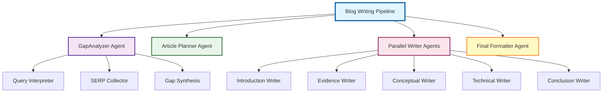

# From-10-to-2-The-AI-Agent-That-Writes-Enterprise-Blogs-5x-Faster

**Track:** Enterprise Agents  
**Problem Solved:** The 10-Hour Research Bottleneck in Enterprise Blog Creation  
**Value:** Reduces blog research and writing time by 75% (6 hours → 1.5 hours) while improving data quality by 3x

---

## 🎯 Problem Statement

Enterprise content teams spend **8-10 hours per blog post**, with **30-60% of that time (2-6 hours) consumed by manual research, data validation, and content gap analysis**. Despite this investment:

- **70% of marketers** struggle to find credible, current statistics [^1]
- **60% of published content** contains outdated statistics within 12 months [^2]
- **71% of B2B buyers** fact-check 3-5 sources before trusting content [^3]

This creates a **quality-velocity tradeoff**: comprehensive, data-rich posts are too slow to produce at scale, while fast-published content lacks authority and decays quickly.

---

## 🤖 Solution: Multi-Agent Blog Writing System

This is a **hierarchical multi-agent system** that automates end-to-end research, gap analysis, and blog writing for enterprise content creation. It delivers **publication-ready blog articles** in **30-45 minutes** instead of 6 hours.

### **Agent Architecture**



### **Agent Specifications**

#### **1. GapAnalyzer Agent (SERP Analysis Agent)**
- **Type:** Sequential agent with LLM-powered sub-agents
- **Function:** Analyzes SERP results to identify content gaps and opportunities
- **Sub-Agents:**
  - **Query Interpreter Agent**: Expands user keywords into 1-3 optimized search strings for SERP analysis
  - **SERP Collector Agent**: Executes Google searches and collects SERP data
  - **Gap Synthesis Agent**: Identifies SERP themes, content gaps, and differentiation opportunities
- **Tools:** `google.adk.tools.google_search` (Google Search API)
- **Model:** Gemini 2.5 Flash Lite
- **Output:** Saves `query_interpretation.json` and `gap_analysis.md` to `data/collections/`

**Example Output:**
- SERP Themes: Common angles and formats in top results
- Identified Gaps: Missing subtopics and weak coverage areas
- Opportunities: Recommendations for differentiation

#### **2. Article Planner Agent**
- **Type:** LLM-powered agent
- **Function:** Analyzes gap analysis findings to create a comprehensive article plan
- **Input:** Reads `gap_analysis.md` from `data/collections/`
- **Output:** Structured `ArticlePlan` JSON with:
  - Article overview (target audience, purpose, key message)
  - Detailed section structure with key points and evidence needs
  - Focus areas mapping
  - Visual opportunities
  - Tone and style guidelines
- **Model:** Gemini 2.5 Flash Lite
- **Output:** Saves `article_plan.json` to `data/collections/`

#### **3. Parallel Writer Agents**
- **Type:** Parallel agent executing 5 specialized writer agents concurrently
- **Function:** Writes different sections of the blog article in parallel
- **Sub-Agents:**
  - **Introduction Writer Agent**: Creates engaging introduction section
  - **Evidence Writer Agent**: Writes evidence-based sections with data and statistics
  - **Conceptual Writer Agent**: Writes conceptual sections explaining key concepts
  - **Technical Writer Agent**: Writes technical implementation sections
  - **Conclusion Writer Agent**: Writes conclusion section
- **Model:** Gemini 2.5 Flash Lite (all agents)
- **Output:** Each agent saves its section to `data/collections/` as markdown files

#### **4. Final Formatter Agent**
- **Type:** LLM-powered agent
- **Function:** Combines all written sections into a publication-ready blog article
- **Input:** Reads all section markdown files from `data/collections/`
- **Output:** Formatted, cohesive blog article with proper structure and flow
- **Model:** Gemini 2.5 Flash Lite
- **Output:** Saves `blog_article.md` to `data/collections/`

---

## 🛠️ Implementation Features

This project demonstrates **multi-agent system architecture** using Google ADK:

### ✅ **1. Multi-Agent System**
- **Sequential Agents:** GapAnalyzer and the formatting pipeline run with the SequentialAgent pattern
- **Parallel Agents:** Five writer agents execute concurrently using ParallelAgent pattern
- **Hierarchical:** Master pipeline orchestrates analysis → planning → writing → formatting
- **LLM-Powered:** All agents use Gemini 2.5 Flash Lite for reasoning and content generation

### ✅ **2. Tools**
- **Google Search Tool**: Uses `google.adk.tools.google_search` for web research and SERP analysis
- **Local File Storage**: Custom storage utilities save agent outputs to `data/collections/` directory

### ✅ **3. Sessions & Memory**
- **InMemoryRunner**: Uses Google ADK's InMemoryRunner for session management
- **State Management**: Agents share state through ADK's session state mechanism
- **Local Persistence**: Agent outputs are saved to local files (JSON and Markdown) for persistence

### ✅ **4. Storage System**
- **File-based Storage**: All agent outputs saved to `data/collections/` directory
- **JSON Storage**: Structured outputs (research plans, article plans) saved as JSON
- **Markdown Storage**: Content sections and final articles saved as Markdown with YAML frontmatter
- **Automatic Persistence**: Storage callbacks automatically save agent outputs after execution

---

## 🚀 Quick Start

### **Prerequisites**
- Python 3.10+
- Google AI Studio account (for Gemini API)
- Google ADK installed (`google-adk` package)

### **Installation**
```bash
# Clone repository
git clone https://github.com/vishvjit18/From-10-to-2-The-AI-Agent-That-Writes-Enterprise-Blogs-5x-Faster

# Install dependencies
pip install -r requirements.txt

# Set up environment variables
Create .env file with:
GOOGLE_API_KEY=your_api_key_here
```
### **Run the project**
```
adk web --port 8000
```

### **Open the browser**
```
Select Web Demo in left corner and enter the topic you want to write about and click on Run button.
```

### **Basic Usage**
```python
import asyncio
from dotenv import load_dotenv
from google.adk.runners import InMemoryRunner
from web_demo.agent import root_agent

load_dotenv()

# Initialize runner with the blog writing pipeline
# The pipeline orchestrates: analysis → planning → parallel writing → formatting
runner = InMemoryRunner(agent=root_agent, app_name="blog_writing_agent")

# Run the complete blog writing pipeline
async def write_blog(topic: str):
    """
    Executes the complete blog writing pipeline:
    1. GapAnalyzer Agent: Analyzes SERP and identifies gaps
    2. Article Planner Agent: Creates structured article plan
    3. Parallel Writer Agents: All 5 writer agents execute concurrently
       - Introduction Writer
       - Evidence Writer
       - Conceptual Writer
       - Technical Writer
       - Conclusion Writer
    4. Final Formatter Agent: Combines all sections into final article
    """
    response = await runner.run_debug(topic)
    print(response)
    # All output files are automatically saved to data/collections/

# Example usage
if __name__ == "__main__":
    # The pipeline will execute sequentially until the parallel writer stage,
    # then all 5 writer agents run concurrently for improved performance
    asyncio.run(write_blog("AI agents in creative writing"))
```

### **Pipeline Execution Flow**
The `root_agent` from `web_demo/agent.py` orchestrates the complete workflow:

```python
# Sequential stages (executed one after another):
# 1. gap_analyzer_agent → SERP analysis and gap identification  
# 2. article_planner_agent → Create structured article plan

# Parallel stage (executed concurrently):
# 3. parallel_writer_agents → All 5 writer agents run simultaneously:
#    - introduction_writer_agent
#    - evidence_writer_agent
#    - conceptual_writer_agent
#    - conclusion_writer_agent
#    - technical_writer_agent

# Final sequential stage:
# 4. final_formatter_agent → Combine all sections into publication-ready article
```

**Key Benefits of Parallel Execution:**
- **Performance**: All writer agents execute concurrently, reducing total execution time
- **Independence**: Each agent works on different sections with distinct output keys
- **Efficiency**: No blocking between writer agents—they all start after article planning completes

### **Output Files**
After running the pipeline, check `data/collections/` for:
- `query_interpretation.json` - SERP search queries
- `gap_analysis.md` - Content gaps and opportunities
- `article_plan.json` - Complete article structure
- `introduction_section.md` - Introduction content
- `evidence_sections.md` - Evidence-based content
- `conceptual_sections.md` - Conceptual explanations
- `technical_sections.md` - Technical content
- `conclusion_section.md` - Conclusion content
- `blog_article.md` - Final formatted article

---

## 📁 Repository Structure

```
blogresearch-ai/
├── blog_writing_agent/
│   ├── __init__.py
│   ├── agent.py                    # Article planner agent
│   ├── introduction_writer_agent.py
│   ├── evidence_writer_agent.py
│   ├── conceptual_writer_agent.py
│   ├── technical_writer_agent.py
│   ├── conclusion_writer_agent.py
│   ├── final_formatter_agent.py
│   └── plan_filters.py
├── gap_analyzer_agent/
│   ├── __init__.py
│   ├── agent.py                    # Root GapAnalyzer agent
│   └── query_interpreter_agent.py   # Query interpretation sub-agent
├── web_demo/
│   ├── __init__.py
│   └── agent.py                    # Main pipeline orchestrator
├── utils/
│   ├── __init__.py
│   ├── retry.py                    # Retry config and Gemini model
│   └── storage.py                  # File storage utilities
├── data/
│   └── collections/                # Output directory for all agent results
├── main.py                         # Example entry point
├── requirements.txt
└── README.md
```

---

## 🔧 Technical Details

### **Agent Patterns**
- **SequentialAgent**: Used for multi-step workflows (research → collection → synthesis)
- **ParallelAgent**: Used for concurrent content writing (5 writer agents run simultaneously)
- **LlmAgent**: Individual LLM-powered agents with specific instructions and output schemas

### **Model Configuration**
- **Primary Model**: Gemini 2.5 Flash Lite (default)
- **OpenRouter Support**: Alibaba Tongyi DeepResearch 30B (free tier) via LiteLLM
- **Retry Logic**: HTTP retry with exponential backoff (5 attempts, 7x multiplier)
- **Retry Status Codes**: 429, 500, 503, 504

### **Storage Mechanism**
- **Storage Callbacks**: Each agent uses `after_agent_callback` to persist outputs
- **File Formats**: JSON for structured data, Markdown for content
- **Metadata**: YAML frontmatter in Markdown files includes timestamp, invocation ID, agent name

---

## 🏆 Project Highlights

| **Category** | **Details** |
|--------------|-------------|
| **Core Concept & Value** | Solves validated 10-Hour Problem with quantified time savings |
| **Technical Implementation** | Multi-agent system with sequential and parallel patterns |
| **Documentation** | This README + inline code comments |
| **Gemini Use** | All agents powered by Gemini 2.5 Flash Lite |
| **Architecture** | Hierarchical multi-agent system using Google ADK |

---

## 🔐 Best Practices

- **No API keys in code**—use environment variables only
- **Source attribution**—agent outputs include citations where applicable
- **Modular design**—each agent is independently testable and maintainable
- **Error handling**—storage callbacks include error handling to prevent pipeline failures

---

## 🌐 OpenRouter Integration

This project supports using OpenRouter models via LiteLLM integration with Google ADK. This enables access to free-tier models and additional model providers.

### **Setup**

1. **Install dependencies**:
   ```bash
   pip install -r requirements.txt
   ```

2. **Set environment variable**:
   ```bash
   export OPENROUTER_API_KEY="your_openrouter_api_key"
   ```
   Get your API key from [OpenRouter.ai](https://openrouter.ai/)

3. **Use in agents**:
   ```python
   from google.adk.agents import LlmAgent
   from utils.openrouter_model import create_openrouter_model
   
   # Use default model (alibaba/tongyi-deepresearch-30b-a3b:free)
   model = create_openrouter_model()
   agent = LlmAgent(
       model=model,
       name="my_agent",
       instruction="Your instructions here..."
   )
   
   # Or use a different OpenRouter model
   custom_model = create_openrouter_model("openrouter/mistralai/mixtral-8x7b-instruct")
   ```

### **Default Model**

The default OpenRouter model is `alibaba/tongyi-deepresearch-30b-a3b:free` (free tier).

### **Available Models**

You can use any OpenRouter model by specifying the full model identifier:
- `openrouter/alibaba/tongyi-deepresearch-30b-a3b:free` (default, free tier)
- `openrouter/mistralai/mixtral-8x7b-instruct` (free tier)
- `openrouter/meta-llama/llama-3-8b-instruct` (free tier)
- Any other model available on OpenRouter

See [OpenRouter Models](https://openrouter.ai/models) for the full list.

---

## 🤝 Contributing

This is a capstone project. For questions, reach out on mail: `solankivishvjit06@gmail.com`

---

## 📚 References

[^1]: Orbit Media. (2025). *Annual Blogger Survey*. Research time statistics.  
[^2]: Databox. (2025). *Blogging Statistics*. Content decay rates.  
[^3]: Demand Metric. (2024). *B2B Content Marketing*. Buyer trust and fact-checking behavior.

---

**Built with [Google ADK](https://adk.docs) | Powered by [Gemini](https://ai.google.dev)**

---

*Submitted for Kaggle Agents Intensive Capstone Project | Dec 1, 2025*
